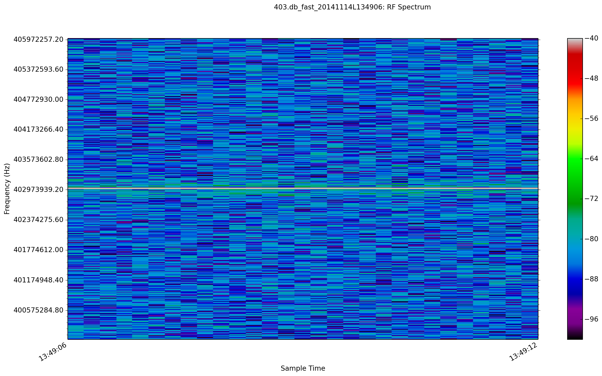

# Plotting Utilities

These are utilities to help in plotting the RF data logged with the tool.


# plot.py

This is a really simple pull and plot utility with little control on the plot.

Usage:

```shell
plot.py <list of files to plot>
```

It is super _stupid_:  It expects either a *.csv or a sqlite *.db data file created by sh-spectrum and churns out a rough plot like below.  On the other hand, it does plot all the sweeps it finds in a database.




# TODO / Feature Creep:

- Plotting
	- How to display data eloquently and usefully.
	- Seconday Program to trace individual data frame by frame